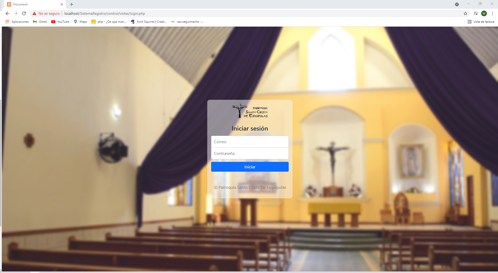

<h1>Repositorio oficial del sistema de registro de actas para sacramentos </h1>

Este es un proyecto de tesis para la universidad Mariano Gálvez de Guatemala

Inicialmente si deseas utilizar el sistema de registro de sacramentos, debes de seguir los siguientes pasos:

<h2> Paso #1 </h2>

Como primer paso debes de instalar algún servidor local que cuente con Php versión 8.0.7 o superior y MySQL con PhpMyadmin. recomiendo que utilices Xampp por la facilidad de la instalación. A continuación, un link de descarga:

> > http://https://www.apachefriends.org/download.html

Puedes descargarlo para el sistema operativo que utilices, sea Windows, OS o Linux.

<h2> Paso #2 </h2>

Luego de tener el servidor local instalado, debemos de descargar los archivos de Github o bien clonarlos y colocarlos en la carpeta correspondiente, según nuestro servidor local, en el caso de Xampp, debemos de colocarlo en la siguiente ruta:

> > C:\xampp\htdocs

si estas usando algún otro debes de colocarlo en la carpeta correspondiente para que se lance correctamente la página WEB

<h2> Paso #3 </h2>

Actualmente el sistema no va a funcionar debido que aún no está creada la base de datos, para eso debemos de dirigirnos a los archivos del sistema y encontraremos un archivo llamado registros.sql este archivo contiene el script correspondiente para la creación de la base de datos.

Nos dirigimos hacia PhpMyadmin y seleccionamos el apartado importar, cuando estemos en el apartado, presionamos el botón de seleccionar archivo, seleccionamos el archivo antes mencionado llamado registros.sql lo cargamos y presionamos continuar y se creará la base de datos en MySQL.

Una vez creada la base de datos en MySQL el sistema esta listo para ser usado.

para acceder al sistema de manera local, abrimos el navegador de nunestra preferencia y colocamos la siguiente ruta en nuestro navegador:

> > https://localhost/SistemaRegistro/control

Seguido encontraremos una interfaz como esta:

  

Las credenciales para ingresar al sistema como un usuario administrador son las siguientes:

<h3> Credenciales </h3>

correo: velasquezmynor.1998@gmail.com
contraseña: Admin123*
